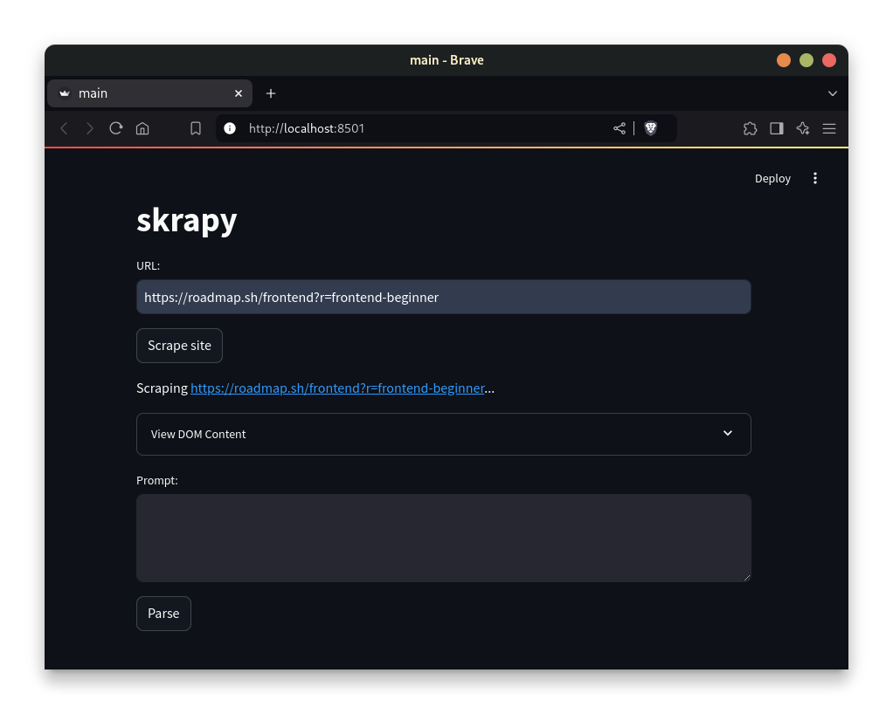
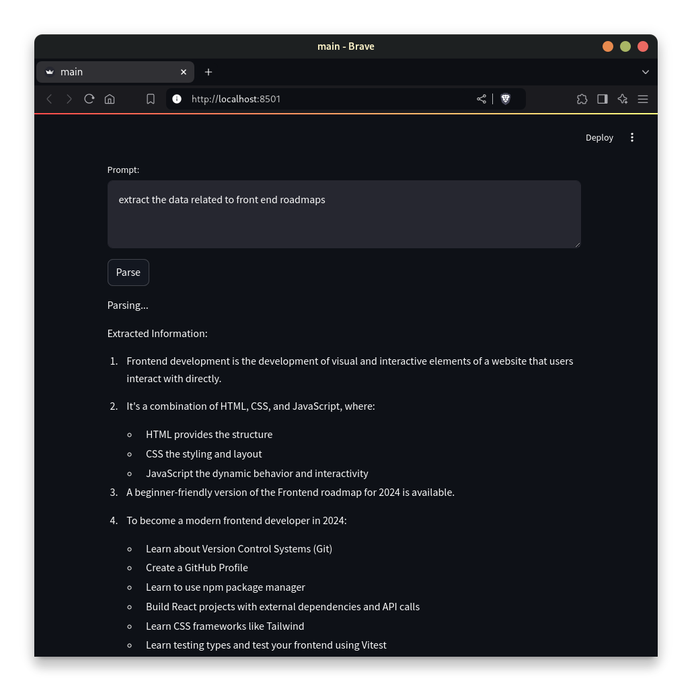

# skrapy
AI powered web scrapper built on selenium

## Installaion
1. Clone the repository
``` bash
git clone https://github.com/bakayu/skrapy.git
cd skrapy
```
2. Run the following command to install the dependencies (using a virtual env/ conda env is recommended)
``` bash
pip -r install requirements.txt
```

__Note:__ Skrapy utilizes a local LLM for parsing data, [ollama](https://github.com/ollama/ollama) and an appropriate model should be installed on your system in order to use the web scrapper, update [llm.py](https://github.com/bakayu/skrapy/blob/main/llm.py) according to the model you want to use.

3. Run the following command to start the web scrapper
``` bash
streamlit run main.py
```

## Usage
1. Enter a url and click on `Scrape site` to start scrapping the website

2. Enter instructions for extracting the data in the prompt section
